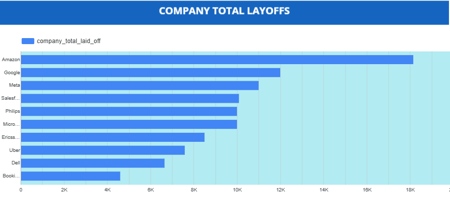

# Introduction
This project delivers a comprehensive visual analysis of global corporate layoffs, drawing on data from more than 1,600 companies across 31 industries. The goal is to uncover key trends, patterns, and impacts of workforce reductions across sectors, regions, and time periods. Through data-driven insights and visualizations, the project highlights how layoffs have evolved and what factors contribute to these changes.

# Tools I Used
- MySQL 
- Looker

# Overview of Analysis


# Data Cleaning
I performed data cleaning using SQL, working with MySQL as both the database management system and query tool.

### 1. Removing Duplicates

```sql
SELECT *,
ROW_NUMBER() OVER(PARTITION BY 
  company, 
  industry, 
  total_laid_off, 
  percentage_laid_off,
  `date`) AS row_num 
FROM layoffs_staging;

WITH duplicate_cte AS (
SELECT *,
ROW_NUMBER() OVER( PARTITION BY 
  company,
  location,
  industry,
  total_laid_off,
  percentage_laid_off,
  `date`,
  stage,
  country,
  funds_raised_millions) AS row_num 
FROM layoffs_staging
)
SELECT *
FROM duplicate_cte
WHERE row_num > 1;

SELECT * 
FROM layoffs_staging
WHERE company ='Casper';

-- Create a new table for removing the duplicates
CREATE TABLE `layoffs_staging2` (
  `company` text,
  `location` text,
  `industry` text,
  `total_laid_off` int DEFAULT NULL,
  `percentage_laid_off` text,
  `date` text,
  `stage` text,
  `country` text,
  `funds_raised_millions` int DEFAULT NULL,
  `row_num` INT 
) ENGINE=InnoDB DEFAULT CHARSET=utf8mb4 COLLATE=utf8mb4_0900_ai_ci;


SELECT * 
FROM layoffs_staging2
WHERE row_num > 1;

INSERT INTO layoffs_staging2
SELECT *,
ROW_NUMBER() OVER( PARTITION BY 
  company,
  location,
  industry,
  total_laid_off,
  percentage_laid_off,
  `date`,
  stage,
  country,
  funds_raised_millions) AS row_num 
FROM layoffs_staging;

DELETE
FROM layoffs_staging2
WHERE row_num >1;
```
### 2. Standardizing the data

```sql
SELECT DISTINCT company, TRIM(company)
FROM layoffs_staging2;

UPDATE layoffs_staging2
SET company = TRIM(company);

SELECT *
FROM layoffs_staging2
WHERE industry Like 'Crypto%';

UPDATE layoffs_staging2
SET industry = 'Crypto'
WHERE industry Like 'Crypto%';

SELECT DISTINCT industry
FROM layoffs_staging2
WHERE industry LIKE 'Crypto%';

SELECT DISTINCT location
FROM layoffs_staging2
ORDER BY location;

UPDATE layoffs_staging2
SET location = 'Florianópolis'
WHERE location = 'Florianópolis';

SELECT DISTINCT country
FROM layoffs_staging2
ORDER BY country;

SELECT
  DISTINCT country,
  TRIM(TRAILING '.' FROM country)
FROM layoffs_staging2
ORDER BY country;

UPDATE layoffs_staging2
SET country = TRIM(TRAILING '.' FROM country)
WHERE country LIKE 'United States%';
 
SELECT `date`
FROM layoffs_staging2;

UPDATE layoffs_staging2
SET `date` = STR_TO_DATE(`date`, '%m/%d/%Y');


ALTER TABLE layoffs_staging2
MODIFY COLUMN `date` DATE;
```

### 3. Working with NULLS
```sql
SELECT *
FROM layoffs_staging2
WHERE total_laid_off IS NULL
AND percentage_laid_off IS NULL;

UPDATE layoffs_staging2
SET industry = NULL
WHERE industry = '';

SELECT t1.industry, t2.industry
FROM layoffs_staging2 t1
JOIN layoffs_staging2 t2
	ON t1.company = t2.company
WHERE (t1.industry IS NULL OR t1.industry = '')
AND t2.industry is NOT NULL;

UPDATE layoffs_staging2 t1
JOIN layoffs_staging2 t2
	ON t1.company = t2.company
SET t1.industry = t2.industry
WHERE (t1.industry IS NULL OR t1.industry = '')
AND t2.industry IS NOT NULL;

SELECT*
FROM layoffs_staging2
WHERE total_laid_off IS NULL
AND percentage_laid_off IS NULL;

DELETE
FROM layoffs_staging2
WHERE total_laid_off IS NULL
AND percentage_laid_off IS NULL;

SELECT *
FROM layoffs_staging2;
```
### 4. Droping Unnecessary Column
```sql
ALTER TABLE layoffs_staging2
DROP COLUMN row_num;
```
# The Analysis
## 1. Company Total Layoffs


#### The chart highlights the companies with the highest reported layoffs.

- Amazon leads significantly, with nearly 20,000 layoffs, far ahead of other firms.
- Google and Meta follow, each with over 10,000 employees laid off, showing how major tech giants were heavily impacted.
- Salesforce, Philips, and Microsoft form the mid-range group, with layoffs around the 8K–10K mark.
- Companies like Ericsson, Uber, Dell, and Booking reported comparatively smaller reductions, but still in the 5K–7K range, indicating widespread workforce cuts across multiple sectors.

Insight:
The data suggests that large technology companies were among the hardest hit, with Amazon alone accounting for the largest share of layoffs. This trend reflects industry-wide cost-cutting measures and restructuring efforts in response to economic pressures and changing market demands.

## 2. Industry Total Layoffs


#### The chart shows how layoffs are distributed across different industries:

- Consumer and Retail sectors recorded the highest layoffs, each exceeding 40,000 employees, highlighting the impact of reduced consumer demand and shifting market conditions.
- Transportation, Finance, and Healthcare also faced significant workforce reductions, each with 30,000+ layoffs, suggesting pressure on both essential and service-driven industries.
- Food, Real Estate, and Travel industries fall in the mid-range, with layoffs between 15,000–25,000, reflecting broader global economic challenges.
- Smaller but notable impacts are observed in Education, Sales, and Crypto, each recording 10,000–15,000 layoffs, showing that even emerging and specialized industries were not immune.
- The lowest layoffs were reported in sectors like Legal, Energy, Aerospace, and Manufacturing, all under 5,000, likely due to smaller workforce sizes or more stable demand.

Insight:
The data reveals that consumer-driven industries (Retail, Consumer, Transportation) were the hardest hit, while highly specialized sectors (Legal, Aerospace, Energy) experienced minimal layoffs. This suggests that layoffs were concentrated where large workforces and fluctuating demand intersected, especially in industries directly tied to consumer behavior and global supply chains.

### Geographic Funding Breakdown


- The United States (yellow) dominates global funding, recording over 1.1 million units of funding, making it the clear leader.

- Countries in blue (mainly parts of Europe and Asia) reflect moderate funding activity, showing they attract significant but not top-tier funding compared to the U.S.

- The majority of countries are in green, meaning they received low levels of funding.

- A large portion of Africa, South America, and parts of Asia remain in red, which likely reflects no available funding data or very limited funding activity.

Takeaway:
Funding is highly concentrated in the U.S., with Europe and Asia capturing some moderate amounts. However, most regions worldwide show limited or missing funding data, highlighting an uneven global distribution of investment.
